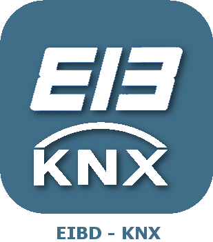

# Protocole domotique

>**IMPORTANT**
>Seuls les plugins de contributeur ont leur documentation ici. Vous pouvez consulter les documentations des plugins officiels directement depuis le Market Jeedom. Une fois sur le plugin en question, cliquez sur documentation.
>Vous pouvez voir [ici](https://market.jeedom.com/index.php?v=d&p=market&type=plugin&categorie=automation+protocol) tous les plugins officiels de cette catégorie

| | | | |
|--- | --- | --- | ---|
||Abeille|Plugin Abeille pour la passerelle Zigate (https://zigate.fr).|[Documentation](http://kiwihc16.free.fr/) - [Market](https://market.jeedom.com/index.php?v=d&p=market_display&id=3219)|
||JeeMySensors|Plugin pour le protocole mySensors|[Documentation](https://totoff974.github.io/jeedom-JeeMySensors/fr_FR/) - [Market](https://market.jeedom.com/index.php?v=d&p=market_display&id=3822)|
||JeePlcBus|Plugin permettant la gestion du protocol PlcBus|[Documentation](https://totoff974.github.io/JeePlcBus/fr_FR/) - [Market](https://market.jeedom.com/index.php?v=d&p=market_display&id=2487)|
||Store|Plugin pour gérer des stores|[Documentation]() - [Market](https://market.jeedom.com/index.php?v=d&p=market_display&id=296)|
||AirSend|Plugin permettant l'envoi de commandes radios (433-434Mhz) à travers l'appareil AirSend|[Documentation](https://devmel.github.io/jeedom_airsend/fr_FR/) - [Market](https://market.jeedom.com/index.php?v=d&p=market_display&id=3611)|
||Boxio|Plugin pour utiliser le module Legrand USB-CPL|[Documentation](https://apages2.github.io/pluginjeedom-boxio/fr_FR/) - [Market](https://market.jeedom.com/index.php?v=d&p=market_display&id=1335)|
||EIB - KNX|Connecter Jeedom avec votre installation domotique KNX et Jeedom deviendra un participant de votre installation|[Documentation](http://mika-nt28.github.io/Documentations/eibd/fr_FR/) - [Market](https://market.jeedom.com/index.php?v=d&p=market_display&id=203)|
||Fibaro|Plugin pour récuperer les données des boxes Fibaro et interagir|[Documentation](https://rems02.github.io/fibaro/fr_FR/) - [Market](https://market.jeedom.com/index.php?v=d&p=market_display&id=3588)|
||Global Cache|Ce plugin permet de connecter tous les appareils Global Cache à Jeedom|[Documentation](https://mika-nt28.github.io/Documentations/globalcache/fr_FR/) - [Market](https://market.jeedom.com/index.php?v=d&p=market_display&id=2932)|
||jMQTT|Ce plugin connecte Jeedom à un broker MQTT comme Mosquitto afin, de récupérer les messages souscrits, et de publier ses propres messages. Il supporte la découverte automatique des équipements mais également leur création manuelle.|[Documentation](https://domotruc.github.io/jMQTT/fr_FR/) - [Market](https://market.jeedom.com/index.php?v=d&p=market_display&id=3166)|
||JeeDore|Plugin passerelle Tydom|[Documentation](https://github.com/rezolv-fr/jeedoredaemon-dotnet/blob/master/docs/index.md) - [Market](https://market.jeedom.com/index.php?v=d&p=market_display&id=3757)|
||Jeedouino|Plugin Jeedouino pour gérer une/des carte(s) Arduino (via Ethernet ou USB ), les GPIO du R.PI, les cartes PiFace (piRack), les cartes RPI IO Plus 32e/s, les MCP23017 (sur RPI) ou les ESP8266 / NodeMCU/ Wemos.|[Documentation](https://revlysj.github.io/jeedouino/fr_FR/index) - [Market](https://market.jeedom.com/index.php?v=d&p=market_display&id=2064)|
||Mochad - X10|Plugin pour gérer des équipements X10 via le démon Mochad et une interface informatique CM15|[Documentation](https://mika-nt28.github.io/Documentations/mochad/fr_FR/) - [Market](https://market.jeedom.com/index.php?v=d&p=market_display&id=359)|
||Myhome|Plugin pour utiliser le module Legrand/Bticino Zigbee|[Documentation](https://apages2.github.io/pluginjeedom-myhome/fr_FR/) - [Market](https://market.jeedom.com/index.php?v=d&p=market_display&id=2445)|
||MyModbus|Plugin pour la gestion de matériel qui ont le protocol ModBus|[Documentation](https://bebel27a.github.io/jeedom-mymobdus.github.io/fr_FR/) - [Market](https://market.jeedom.com/index.php?v=d&p=market_display&id=3858)|
||Osram Lightify|Plugin permettant de contrôler les ampoules Osram Lightify|[Documentation]() - [Market](https://market.jeedom.com/index.php?v=d&p=market_display&id=2811)|
||RPICT7V1|Plugin permettant d'utiliser sur Jeedom les cartes RPICT series en HAT pour Raspberry Pi.|[Documentation](https://tlierdotfr.github.io/jeedom-plugin-rpict/fr_FR/) - [Market](https://market.jeedom.com/index.php?v=d&p=market_display&id=3637)|
||Tahoma|Plugin pour utiliser Tahoma et Connexoon|[Documentation](https://github.com/redbug26/jeedom-tahoma/tree/master/doc/fr_FR/index.asciidoc) - [Market](https://market.jeedom.com/index.php?v=d&p=market_display&id=1719)|
||Téléinfo|Plugin pour utiliser les modems téléinformation USB / Série|[Documentation](https://NextDom.github.io/plugin-teleinfo/fr_FR/) - [Market](https://market.jeedom.com/index.php?v=d&p=market_display&id=260)|
||ZiGate|Plugin zigate pour utilisation de la zigate|[Documentation](https://jeedom-zigate.github.io/jeedom-plugin-zigate) - [Market](https://market.jeedom.com/index.php?v=d&p=market_display&id=3186)|
||ZmWebRelay|Plugin permettant la gestion du ZmWebRelay|[Documentation](https://jeedomsteph37.github.io/zmwebrelay/fr_FR/) - [Market](https://market.jeedom.com/index.php?v=d&p=market_display&id=3417)|
